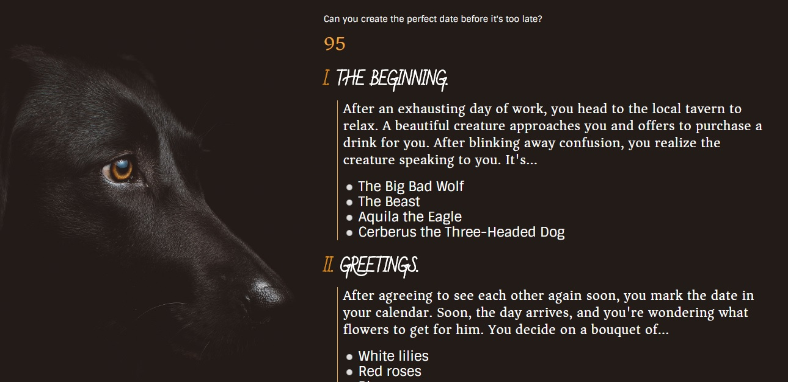

# date the wolf, not the others

thursday, february 15, 2018 - A fun dating game using JavaScript and jQuery!

### the premise

Date the Wolf is an otome-inspired game. Otome (oh-TOE-may) is a Japanese dating simulator game designed for women or "maidens" and usually follows the viewpoint of the main character and her journey of romancing one of the male love interests in the game. There are usually "good" ends and "bad" ends depending on your in-game choices.

I took interest in this style of storytelling and wanted to create a trivia game that incorporated "right" and "wrong" answers, which would ultimately lead to a "good" or "bad" ending. In this case, the title of this game - Date the Wolf, Not the Others - is a bit of a hint as to what choices you should make to successfully earn a "good" ending.

The theme of this story is also inspired by the characters' actions in the visual novel Doki Doki Literature Club, which I recommend.

### how this game works (code-wise)

As the user reads the prompts, they are given four choices as to how they would like to format their date. Every radio button has a name and value attached to it. The names (q1, q2, etc…) are keys that are stored in an object, and their values are true, false, or null which are used for the grading. The object updates in real-time based on the user's choices. 

When the user submits their choices, the JavaScript goes through the user's choices and counts the amount of correctly-chosen values and the wrongly-chosen values, based on if the value is true or false.

Each correct answer (value = true) means the counter for correct answers increases by one. Each incorrect answer (value = false) means the counter for incorrect answers increases by one. And if the user refuses to answer a question, the answer for that question becomes null and increases the null counter by one. The amount of correct and incorrect answers is shown on the score page.

The timer refreshes every second and is replaced by the new number using jQuery.

### future features

Please visit the future features right ! 

### let's play?

Of course! Visit the Wolf here:

https://mr-thylacine.github.io/trivia-game/

